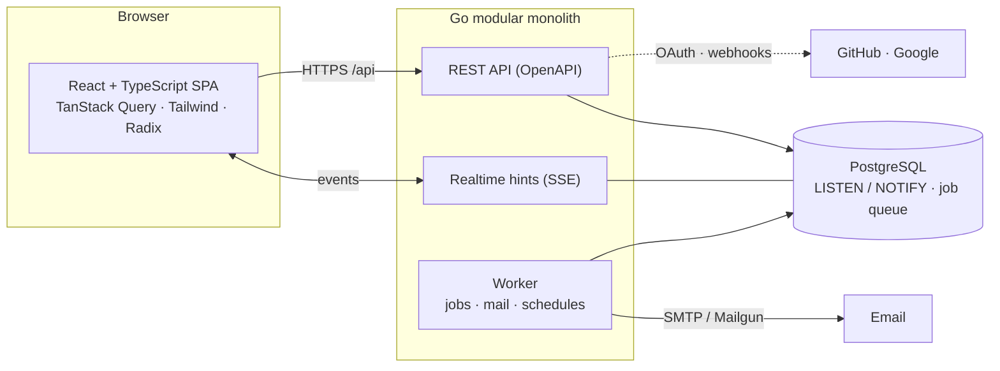

<div align="center">

# LecodeKanban

**Plan, track and ship — together.**
A modular work-management platform: boards, tasks, time, documents, chat and reports in one place,
with the access control and security a company needs. Ukrainian and English.

[](#quality-gates)
[](LICENSE)
[](#contributing)


[Features](#features) · [Quick start](#quick-start) · [Architecture](#architecture) · [Deployment](#deployment) ·
[Make targets](#make-targets) · [Docs](#documentation)

</div>

---

## Features

|                           |                                                                                                                                                                                                                                                                   |
| ------------------------- | ----------------------------------------------------------------------------------------------------------------------------------------------------------------------------------------------------------------------------------------------------------------- |
| **Boards & tasks**        | Drag-and-drop Kanban with swimlanes, WIP limits, custom columns and saved views; list and calendar views; subtasks, checklists, custom fields, labels, attachments with previews, comments with @mentions, activity, a Trash with restore, CSV import and export. |
| **Templates & recurring** | Task templates with a checklist and subtasks, created in one step or on a daily, weekly or monthly schedule.                                                                                                                                                      |
| **Time**                  | A timer and an estimate on every task, a header timer menu with recent tasks, and a weekly timesheet.                                                                                                                                                             |
| **Performance**           | Throughput, cycle and lead time, overdue share, WIP, burn-up, cumulative flow and workload per person, with filters and CSV.                                                                                                                                      |
| **Docs & chat**           | A page tree with a rich editor, Markdown/HTML export; channels, threads, pins, reactions, presence.                                                                                                                                                               |
| **Integrations**          | GitHub (links, rules), Google Calendar (meetings and reminders), email — built in.                                                                                                                                                                                |
| **Security & admin**      | Roles and custom permissions, two-factor sign-in (TOTP + recovery codes), required 2FA, audit log, an admin centre for workspace rules, look and email.                                                                                                           |
| **Help & support**        | Search, quick start, guides in English and Ukrainian, shortcuts, a support inbox and a technical _What's new_.                                                                                                                                                    |
| **Experience**            | Light and dark themes, compact or comfortable density, keyboard shortcuts (`?`), a command palette (<kbd>Ctrl</kbd>/<kbd>⌘</kbd>+<kbd>K</kbd>), realtime updates.                                                                                                 |

> Next up: global search, digests and reminders, automations, public links,
> webhooks and API tokens. The roadmap is also listed on the Help page → _What's new_ → _Planned_.

## Requirements

- **Go** 1.24+ (developed on 1.27)
- **Node** 20.19+
- **Docker** — Postgres and Mailpit in development, testcontainers in tests
- optionally [golangci-lint](https://golangci-lint.run) v2

## Quick start

```bash
cp .env.example .env      # then fill in the secrets (see the comments inside)
make install              # Go modules + npm packages
make dev                  # Postgres + Mailpit, migrations, API (hot reload) and web
```

| What                                                   | Where                                      |
| ------------------------------------------------------ | ------------------------------------------ |
| App                                                    | `http://localhost:47100` (`LK_PUBLIC_URL`) |
| UI kit                                                 | `/ui-kit` (after signing in)               |
| Dev mailbox (Mailpit, basic auth `LK_MAILPIT_UI_AUTH`) | `http://localhost:47105`                   |
| API health / readiness                                 | `127.0.0.1:47101/healthz`, `/readyz`       |
| Prometheus metrics                                     | `127.0.0.1:47106/metrics`                  |

Register at `/register`; the verification email arrives in Mailpit. Invite teammates from **Team**.
Press <kbd>Ctrl</kbd>/<kbd>⌘</kbd>+<kbd>K</kbd> anywhere for the command palette and <kbd>?</kbd> for the shortcuts of the page you are on.

## Architecture

A modular monolith: every backend module owns its tables, its generated queries and its HTTP layer, and talks to
the others only through small interfaces and published database views.



```text
backend/                Go: cmd/ (server, worker, migrate, seed, adduser) and internal/modules/<name>/{domain,service,repository,transport}
frontend/               React + TypeScript: features/<name>, shared/ (design system), app/ (shell, routing)
api/openapi.yaml        The single source of truth for the API → Go DTOs, the TypeScript client and docs/API.md
docs/                   Architecture, API reference, design tokens, audit log, changelog and ADRs
```

## Deployment

The app runs permanently from `docker-compose.yml` (Postgres, Mailpit, migrations, API, worker, and nginx serving
the SPA and proxying `/api`). Every service uses `restart: unless-stopped`, so Docker brings it back after crashes
and reboots — no terminal session needed.

```bash
make deploy        # build images + (re)start; run after pulling new code
make deploy-ps     # container status / health
make deploy-logs   # follow api, worker and web logs
```

Only port `47100` is public; Postgres (`127.0.0.1:47102`) and SMTP stay on loopback, so `make seed` and
`make migrate-up` from the host keep working. While the stack runs, ports 47100–47105 are taken: for hot-reload
development stop it first (`make deploy-down`, then `make dev`). See [ADR 0009](docs/adr/0009-always-on-docker-deployment.md).

Put the public address in `LK_PUBLIC_URL` (for example `https://kanban.example.com`). It is used for links in emails and
OAuth callbacks.

## Make targets

| Target                                                | What it does                                                           |
| ----------------------------------------------------- | ---------------------------------------------------------------------- |
| `make dev`                                            | Dependencies + migrations, then the API (air) and Vite in parallel     |
| `make deps-up` / `deps-down`                          | Start/stop Postgres and Mailpit (`docker-compose.dev.yml`)             |
| `make migrate-up` / `migrate-down` / `migrate-status` | goose migrations (embedded in the binary)                              |
| `make migrate-create name=x`                          | New SQL migration                                                      |
| `make gen`                                            | sqlc, Go DTOs, the TS client and `docs/API.md` from `api/openapi.yaml` |
| `make gen-check`                                      | Fail if generated code is stale (CI)                                   |
| `make test`                                           | Go tests (testcontainers PostgreSQL) + Vitest                          |
| `make e2e`                                            | Playwright end-to-end tests with axe accessibility checks              |
| `make lint`                                           | `go vet`, golangci-lint, `tsc`, ESLint, Prettier                       |
| `make check`                                          | lint + test                                                            |
| `make build`                                          | Static Go binaries in `backend/bin` + the web bundle                   |

## Configuration

<details>
<summary><b>OAuth sign-in (optional)</b></summary>

Create OAuth apps and set `LK_GOOGLE_CLIENT_*` / `LK_GITHUB_CLIENT_*`. The callback URL is
`$LK_PUBLIC_URL/api/v1/auth/oauth/<google|github>/callback`. Google requires a hostname, not a bare IP
(see [ADR 0005](docs/adr/0005-authentication-and-sessions.md)). Buttons for unconfigured providers are shown disabled.

</details>

<details>
<summary><b>Email (invitations, reminders, support requests)</b></summary>

A fresh deployment sends mail to Mailpit, a test inbox, so nothing reaches real inboxes. Connect a provider in `.env`
(see **Settings → Email** in the admin centre, or `.env.example`): `LK_PROD_SMTP_HOST/PORT/TLS` (what the containers read; `LK_SMTP_HOST/PORT/TLS` are only the host-side
Mailpit used by `make seed` and `make dev`) and `LK_SMTP_USERNAME/PASSWORD/FROM`, or
`LK_MAIL_PROVIDER=mailgun` with `LK_MAILGUN_*`. Then `docker compose up -d api worker` — the worker sends the queued
mail, so it must be running. **Settings → Email** shows the queue and the last emails, and can send a test message.

</details>

<details>
<summary><b>Creating accounts without invitations</b></summary>

Add people to a workspace without sending invitations. The command prints a one-time password for each new account;
hand it over privately and ask them to change it under **Profile → Security**.

```bash
# from a checkout with the database reachable
make adduser WS="Acme Studio" EMAILS="alex@example.com sam@example.com" LOCALE=uk

# on the server, from the deployed stack
docker compose run --rm --entrypoint /app/adduser api -workspace "Acme Studio" -locale uk alex@example.com
```

Existing accounts are only added to the workspace. `-role admin|member|viewer` sets the role (default `member`).

If someone lost their password and email is not set up yet, give them a new one-time password (this also lifts a
sign-in lock and signs them out everywhere):

```bash
docker compose run --rm --entrypoint /app/adduser api -reset alex@example.com
```

</details>

## Quality gates

Every change goes through `make check`: Go tests against a real PostgreSQL, Vitest, type checks, ESLint, Prettier,
generated-code freshness and Playwright end-to-end tests with axe (WCAG 2 A/AA) in light and dark themes. Translations
are checked for parity between English and Ukrainian, and design values must come from tokens, never raw colours.

## Documentation

- [Architecture](docs/ARCHITECTURE.md)
- [API reference](docs/API.md) (generated) and the [OpenAPI spec](api/openapi.yaml)
- [Design tokens](docs/DESIGN_TOKENS.md)
- [Integrations](docs/INTEGRATIONS.md)
- [Changelog](docs/CHANGELOG.md) · [Audit log of verification](docs/AUDIT.md)
- [Architecture decision records](docs/adr)

## Contributing

1. Branch from `main`, one pull request per feature.
2. Run `make check` (and `make e2e` for UI changes) before pushing.
3. Update `docs/CHANGELOG.md` and `docs/AUDIT.md`; add both English and Ukrainian strings.
4. Keep Help → _What's new_ current: add the change (and move or add the roadmap item) in `frontend/public/locales/{en,uk}/help.json` under `whatsNew`.

## License

Released under the [MIT License](LICENSE).
